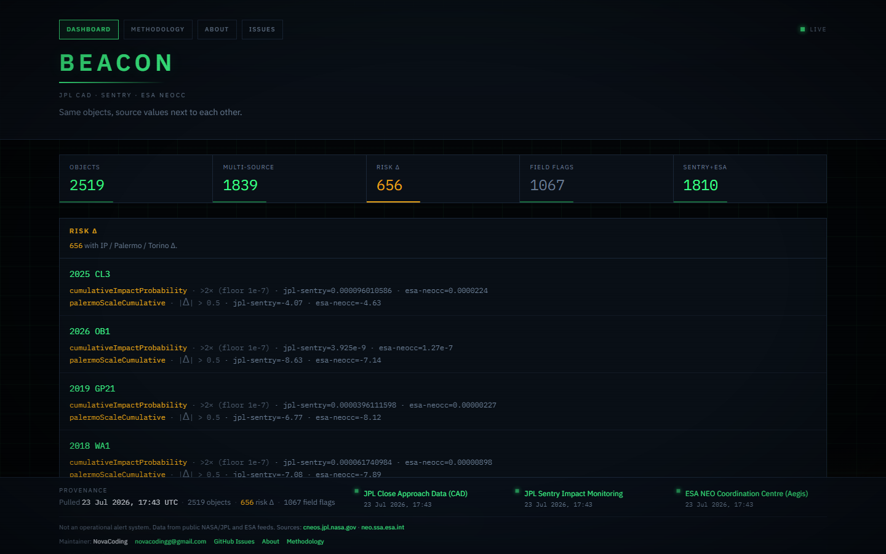
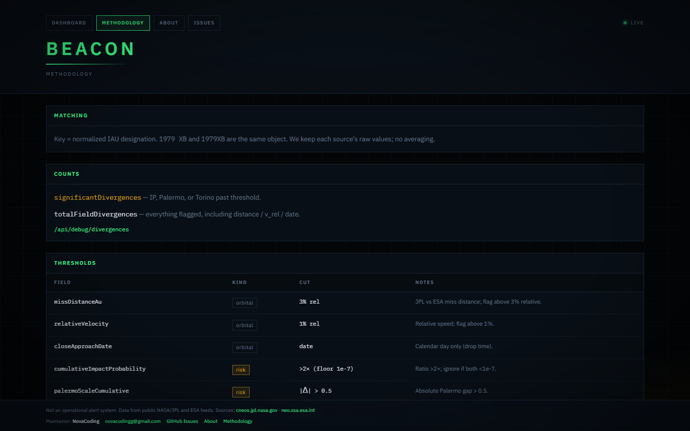

# BEACON

[](https://github.com/NovaCoding-G/B.E.A.C.O.N/actions/workflows/ci.yml)
[](https://github.com/NovaCoding-G/B.E.A.C.O.N/blob/main/LICENSE)
[](https://nextjs.org/)
[](https://www.typescriptlang.org/)
[](https://vitest.dev/)

**Bayesian Earth-impact Assessment & Cross-source Observation Network**

An open-source platform for transparent comparison of publicly available near-Earth object (NEO) data across independent sources.

**Live instance:** [novabeacon.vercel.app](https://novabeacon.vercel.app) · **Methodology:** [`/methodology`](https://github.com/NovaCoding-G/B.E.A.C.O.N/blob/main/app/methodology/page.tsx)

---

## Why BEACON exists

Near-Earth object monitoring is distributed across independent systems — JPL Close Approach Data, JPL Sentry, ESA NEOCC (Aegis) — each performing its own orbit determination. Comparing them today means visiting each source separately. BEACON retrieves all three, matches records referring to the same object, and shows the original values side by side — without merging, averaging, or re-deriving them.

## Philosophy

Independent orbit-determination centers working from overlapping but non-identical observational arcs will not, in general, report identical values. This is an ordinary property of independent estimation, not a defect in either system. BEACON treats a difference between sources as information, not as an error attributable to either institution — it does not attempt to decide which source is more accurate. The objective is transparency and reproducibility.

## Features

- Retrieves JPL Close Approach Data, JPL Sentry, and ESA NEOCC (Aegis)
- Matches objects on normalized IAU designation (`1979 XB` ≡ `1979XB`)
- Displays original per-source values — no averaging, no proprietary score
- Field-specific comparison thresholds, documented (see Methodology)
- Object view with side-by-side source table + simplified miss-distance sketch
- Raw metrics endpoint (`/api/debug/divergences`) for independent verification

## Methodology

A single uniform cutoff across all fields is scientifically weak: fields differ by orders of magnitude in scale, and differ in the kind of uncertainty they carry. BEACON compares each field with a rule chosen for its own statistical behavior:

| Field | Comparison rule | Rationale |
| --- | --- | --- |
| Close-approach distance | Relative tolerance | Routine variation between orbit fits |
| Relative velocity | Relative tolerance | Same |
| Close-approach date | Date-only comparison | Sources differ in time granularity |
| Cumulative impact probability | Ratio-based (log-scale), with negligibility floor | Spans orders of magnitude; relative tolerance is meaningless here |
| Palermo Scale | Absolute-difference threshold | Already logarithmic |
| Torino Scale | Exact match | Coarse integer scale — any difference is notable |

Two figures are exposed: `totalFieldDivergences` (all flagged fields) and `significantDivergences` (objects where a risk-bearing field — IP, Palermo, or Torino — exceeds threshold). Both, with the underlying data, are available at `/api/debug/divergences`.

## Non-goals

BEACON does not:
- Predict impacts
- Replace NASA, JPL, or ESA systems
- Determine which source is correct when they differ
- Compute a proprietary or aggregate risk score
- Function as an operational warning system

## Architecture

```
JPL CAD / Sentry / ESA NEOCC
        ↓
lib/sources/*  (fetch, parse, Zod, 15 min cache)
        ↓
lib/reconcile.ts  (designation matching, per-field thresholds)
        ↓
app/ pages and components
```

Details: [ARCHITECTURE.md](https://github.com/NovaCoding-G/B.E.A.C.O.N/blob/main/ARCHITECTURE.md) — cache lifetimes, API routes, view filters (`?view=all|multi|divergent|risk`).

## Stack

| | |
| --- | --- |
| App | Next.js 16 (App Router) · React 19 · TypeScript |
| UI | Tailwind 4 · Three.js / R3F (approach sketch) |
| Data | Zod validation · in-memory TTL cache, no DB |
| Tests | Vitest |

## Screenshots


*Dashboard — live JPL + ESA data, risk-divergent objects highlighted.*



## Quick start

```bash
git clone https://github.com/NovaCoding-G/B.E.A.C.O.N.git
cd B.E.A.C.O.N
npm install
npm run dev
```

Open <http://localhost:3000>, or skip setup: [live demo](https://novabeacon.vercel.app). No database, no API keys. On Windows use the npm scripts (`NODE_OPTIONS=--use-system-ca`, required for ESA TLS).

## Roadmap

**Implemented:** cross-source retrieval (JPL CAD/Sentry + ESA NEOCC), per-field thresholds, object comparison view, methodology page + raw metrics endpoint.

**Planned:** third independent source (NEODyS/Clomon2), persistent cache, historical tracking of value evolution,UI redesign.

**Future research:** full Keplerian orbit rendering, public API for reconciled data, independent review of methodology by orbit-determination practitioners.

## Limitations

- ESA NEOCC format isn't a versioned API and may change without notice
- Cache is in-memory and per-instance, not shared across invocations
- 3D view is a miss-distance sketch, not a full orbital propagation
- No recomputation of impact probability, Palermo, or Torino values — source values only

## Contributing

See [CONTRIBUTING.md](https://github.com/NovaCoding-G/B.E.A.C.O.N/blob/main/CONTRIBUTING.md) and [CODE_OF_CONDUCT.md](https://github.com/NovaCoding-G/B.E.A.C.O.N/blob/main/CODE_OF_CONDUCT.md). Feedback from anyone with orbit-determination or planetary-defense background is especially welcome.

## Citation

```
NovaCoding (2026). BEACON. v0.1.0. https://github.com/NovaCoding-G/B.E.A.C.O.N
```
Also [CITATION.cff](https://github.com/NovaCoding-G/B.E.A.C.O.N/blob/main/CITATION.cff).

## License

[MIT](https://github.com/NovaCoding-G/B.E.A.C.O.N/blob/main/LICENSE)

## Acknowledgements

Data published by [NASA/JPL CNEOS](https://cneos.jpl.nasa.gov/) and [ESA NEO Coordination Centre](https://neo.ssa.esa.int/). BEACON is not affiliated with, or endorsed by, either institution.
